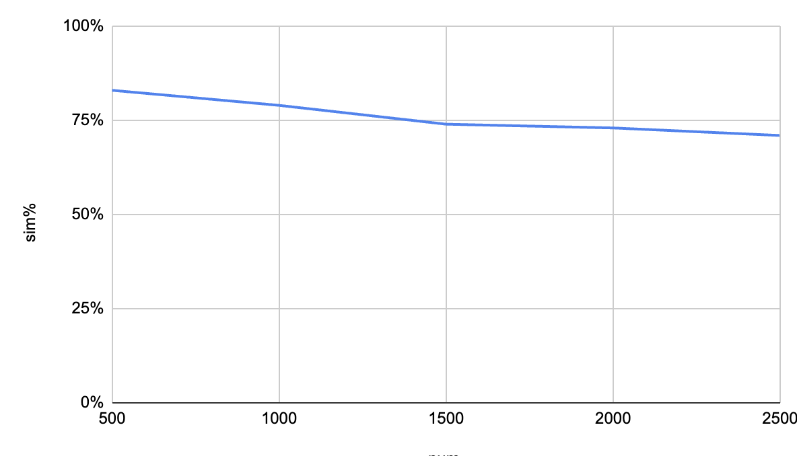
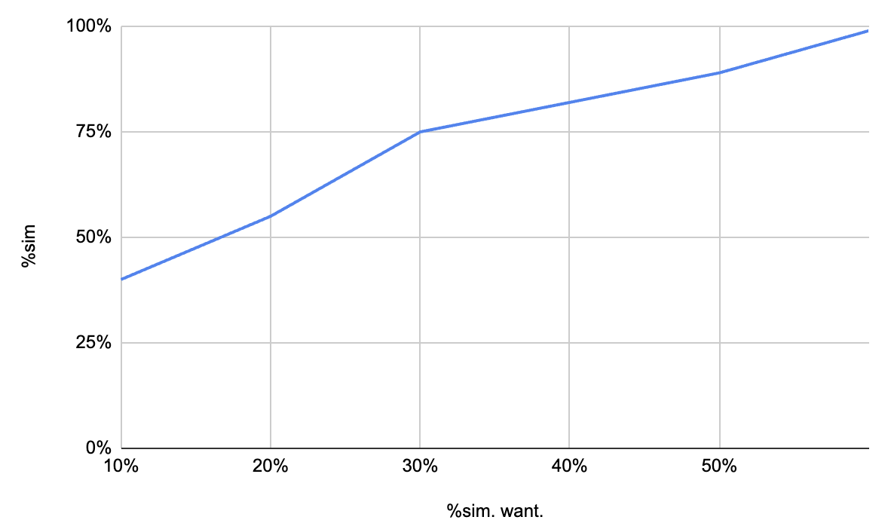
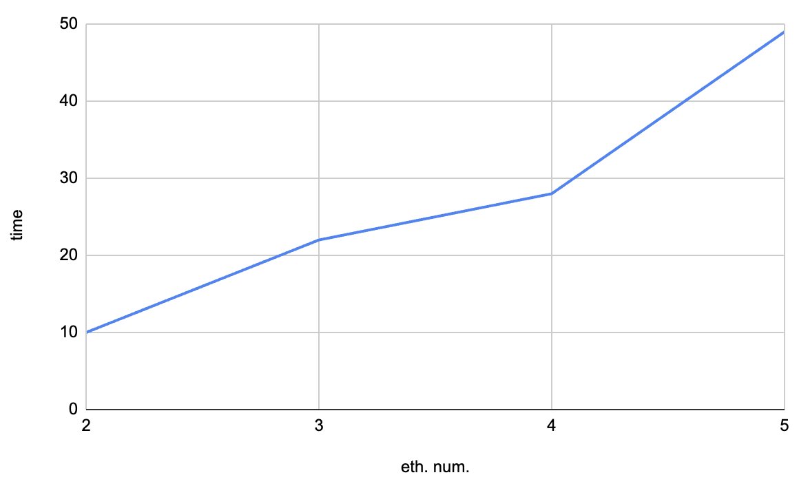

## Комп'ютерні системи імітаційного моделювання
## СПм-23-5, **Шандиба Антон Сергійович**
### Лабораторна робота №**1**. Опис імітаційних моделей та проведення обчислювальних експериментів

 

### Варіант 8, модель у середовищі NetLogo:
[Segregation Simple Extension 1](http://www.netlogoweb.org/launch#http://www.netlogoweb.org/assets/modelslib/IABM%20Textbook/chapter%203/Segregation%20Extensions/Segregation%20Simple%20Extension%201.nlogo)

 

### Вербальний опис моделі: 

Моделяція поведінки черепах різних етнічних груп у міфічному ставку. Всі черепахи ладнають між собою. Але кожна черепаха хоче переконатися, що вона живе біля якогось «свого». Симуляція показує, як ці індивідуальні параметри впливають на ставок.

### Керуючі параметри:
- **number**. Загальна кількість черепах.
- **%-similar-wanted**. Визначає відсоткову потребу подібності сусідів.
- **number-of-ethnicities**. Кількість етносів черепах.

### Внутрішні параметри:
- **percent similar**. Визначає середній відсоток подібності сусідів, кожної черепахи.
- **percent unhappy**. Визначає поточний відсоток нещасливих черепах, які мають меньше подібних сусідів, ніж потрібно.

### Показники роботи системи:
- Проміжок часу в тактах.
- Поточний відсоток подібності черепах.
- Поточний відсоток нещасливих черепах.

### Примітки:
При повторних тестах з однаковими заданими значеннями можуть незначно змінюватися результати часу в тактах та відсоток подібності, відхилення може сягати 1-5%.
Поки відсоток нещастності не буде дорівнювати нулю, цикл симуляції не буде закінчений.

### Недоліки моделі:
Зміна швидкості моделювання, впливає на кінечних результат часу для заверщення симуляції.

 

## Обчислювальні експерименти

### 1. Вплив кількості осіб на відсоток подібності.
Досліджується залежність відсотка подібності від спільної кількості осіб.
Експерименти проводяться при кількості 500-2500 осіб, з кроком в 500, усього 5 симуляцій.
Інші керуючі параметри мають значення за замовчуванням:
- **%-similar-wanted**: 30%
- **number-of-ethnicies**: 3.

<table>
<thead>
<tr><th>Кількість осіб</th><th>%подібності оточення</th></tr>
</thead>
<tbody>
<tr><td>500</td><td>83%</td></tr>
<tr><td>1000</td><td>79%</td></tr>
<tr><td>1500</td><td>74%</td></tr>
<tr><td>2000</td><td>73%</td></tr>
<tr><td>2500</td><td>71%</td></tr>
</tbody>
</table>

Графік наочно показує, що при збільшенні кількості осіб, знижується відсоток подібності в середовищі.

### 2. Вплив відсоток потрібної подібності кількості осіб на загальний відсоток подібності.
Досліджується залежність відсоток потреби подібності від необхідного відсодка подібних до черепахи сусідів.
Експерименти проводяться при 10-60%, з кроком в 10%, усього 6 симуляцій.
Інші керуючі параметри мають значення за замовчуванням:
- **number**: 2000.
- **number-of-ethnicies**: 3.

<table>
<thead>
<tr><th>Відсоток потрібної подібності</th><th>Відсоток загальної подібності</th></tr>
</thead>
<tbody>
<tr><td>10%</td><td>40%</td></tr>
<tr><td>20%</td><td>55%</td></tr>
<tr><td>30%</td><td>75%</td></tr>
<tr><td>40%</td><td>82%</td></tr>
<tr><td>50%</td><td>89%</td></tr>
<tr><td>60%</td><td>99%</td></tr>
</tbody>
</table>

Графік наочно показує, що при збільшенні потреби в подібності, збільшується загальна подібність в середовищі.

### 3. Вплив кількості етносів на час для знаходження подібних
Досліджується залежність потрібного часу в тактах для знаходження подібних в залежності від спільної кількості етносів.
Експерименти проводяться при 2-5 етносах, з кроком 1, усього 4 симуляцій.
Інші керуючі параметри мають значення за замовчуванням:
- **number**: 2000.
- **%-similar-wanted**: 30%.

<table>
<thead>
<tr><th>Кількість етносів</th><th>Час для завершення симуляції в тактах</th></tr>
</thead>
<tbody>
<tr><td>2</td><td>10</td></tr>
<tr><td>3</td><td>22</td></tr>
<tr><td>4</td><td>28</td></tr>
<tr><td>5</td><td>49</td></tr>
</tbody>
</table>

Графік наочно показує, що при збільшенні кількості етносів, зростає й час для знаходження подібних між собою осіб.
