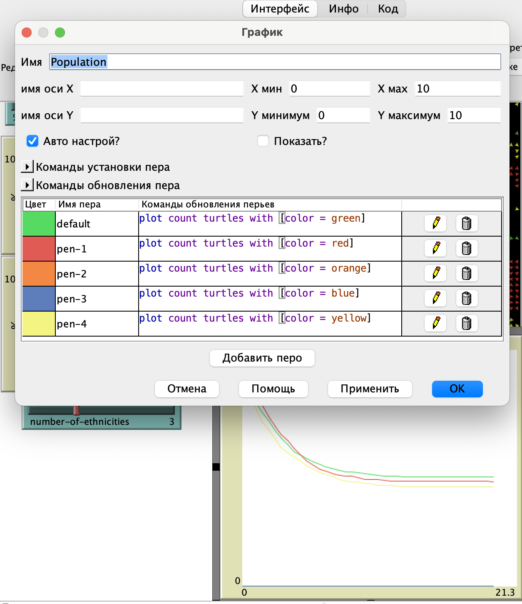
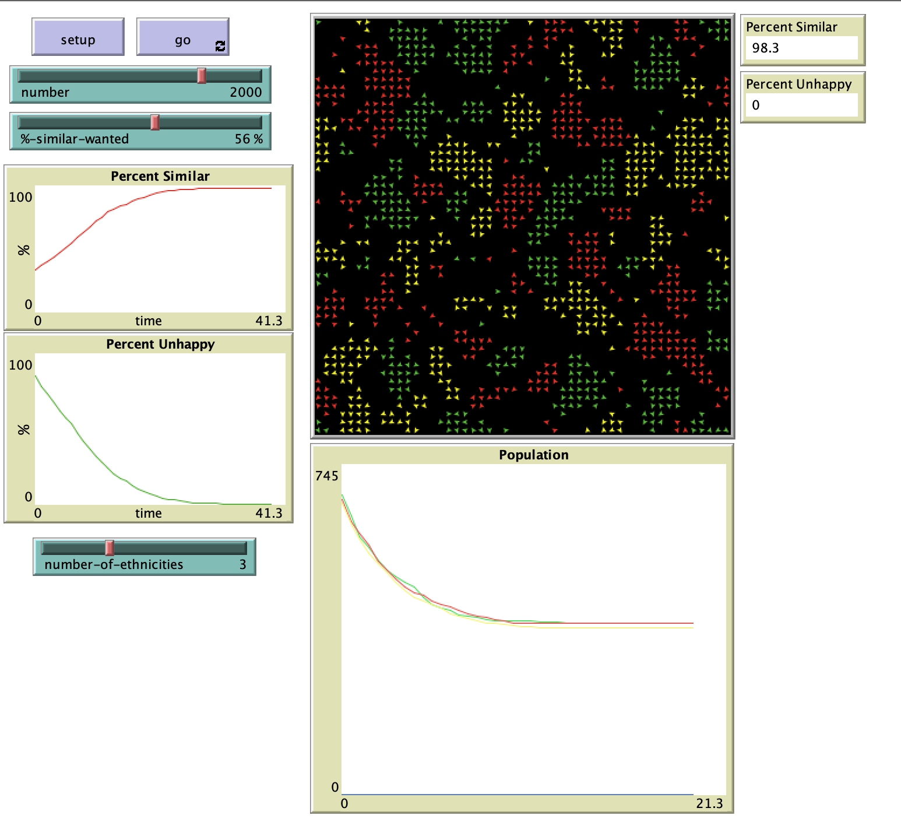
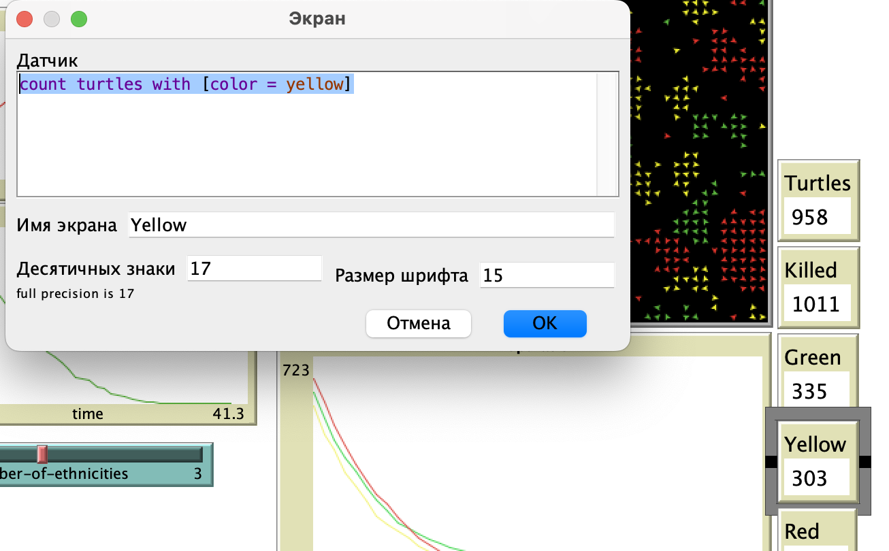
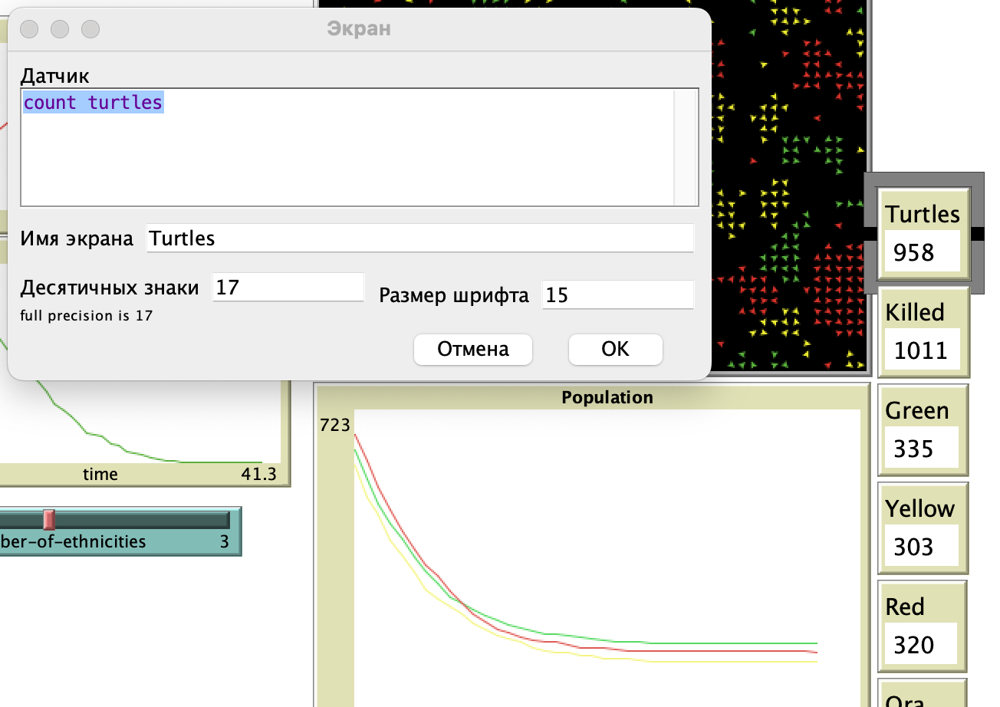
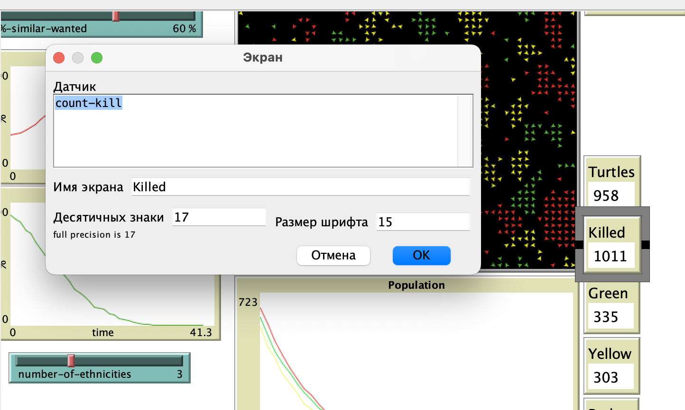
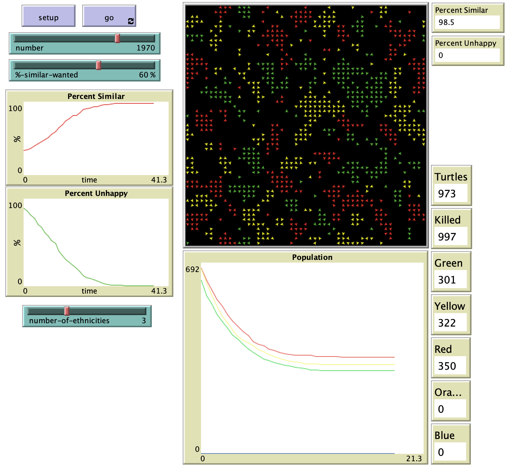
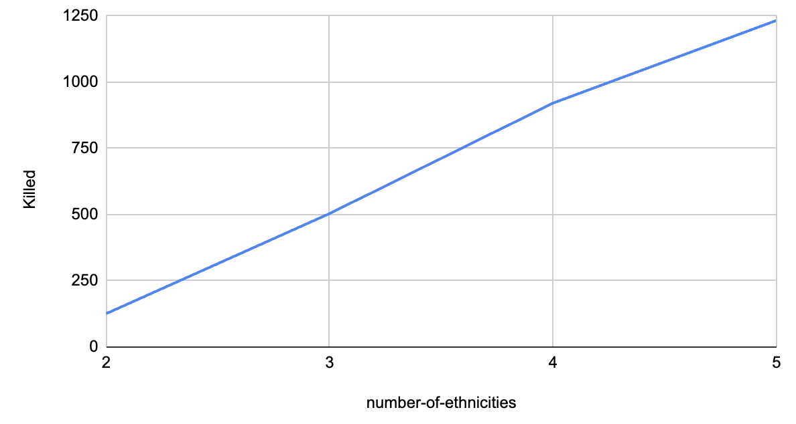

## Комп'ютерні системи імітаційного моделювання
## СПм-23-5, **Шандиба Антон Сергійович**
### Лабораторна робота №**2**. Редагування імітаційних моделей у середовищі NetLogo

 

### Варіант 8, модель у середовищі NetLogo:
[Segregation Simple Extension 1](http://www.netlogoweb.org/launch#http://www.netlogoweb.org/assets/modelslib/IABM%20Textbook/chapter%203/Segregation%20Extensions/Segregation%20Simple%20Extension%201.nlogo)

 

### Внесені зміни у вихідну логіку моделі, за варіантом:

Внесено нові змінні *turtles-own*, для подальшого обчислення свого оточення на наявність ворогів(інших етносів) та союзників(представників подібного етносу):
<pre>
  enemy-nearby   ;; how many enemy patches have a turtle?
  ally-percent
  enemy-percent
  surrounded?
</pre>
Розроблено логіку підрахунку процентажу союзників та противників у процедурі **update-turtles**:
<pre>
;; percentage allies
set ally-percent (ifelse-value total-nearby != 0 [((similar-nearby / total-nearby) * 100)] [0])
;; percentage enemies
set enemy-percent (ifelse-value total-nearby != 0 [((enemy-nearby / total-nearby) * 100)] [0])
</pre>
Розроблено логіку розрахунку ворожого оточення у процедурі **update-turtles**:
<pre>
  ;; count enemies
  set enemy-nearby (total-nearby - similar-nearby)
</pre>
Використано створені змінні для обчислення значення *оточеності*:
<pre>
set surrounded? ally-percent < enemy-percent
</pre>
Розроблено модель вбивства оточених черепах у новій процедурі **kill-surrounded**:
<pre>
to kill-surrounded
  ask turtles with [ surrounded? ] [
    if random 10 = 1 [ die ]       ;; 10% chance that surrounded turtle will be killed
  ]
end
</pre>
Внесено графік зміни розміру популяції:

Скріншот моделі в процесі симуляції:

 

### Внесені зміни у вихідну логіку моделі, на власний розсуд:
Відображено лічильник під кожен етнос черепах:

Відображена загальна кількість живих черепах:

Відображено лічильник вбитих черепах:

<pre>
set count-kill number - count turtles
</pre>

Скріншот моделі в процесі симуляції:

 

## Обчислювальні експерименти
### 1. Вплив кількості етносів черепах на кількість вбивств.
Досліджується залежність показника **Killed** від керуючого параметру **number-of-ethnicities**.
Експеременти проводяться при 2-5 кількості етносів, з короком в 1, усього 4 симуляції.
Інші керуючі параметри за замовчуванням:
- **%-similar-wanted** 50%
- **number** 2000

<table>
<thead>
<tr><th>numbrt-of-ethnicities</th><th>Killed</th></tr>
</thead>
<tbody>
<tr><td>2</td><td>126</td></tr>
<tr><td>3</td><td>504</td></tr>
<tr><td>4</td><td>921</td></tr>
<tr><td>5</td><td>1233</td></tr>
</tbody>
</table>

Графік наочно показує, що при збільшенні кількості етносів, зростає й кількість вбитих черепах.
