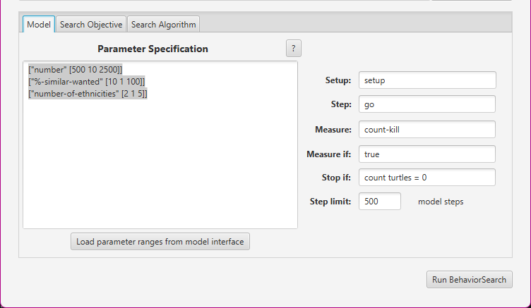
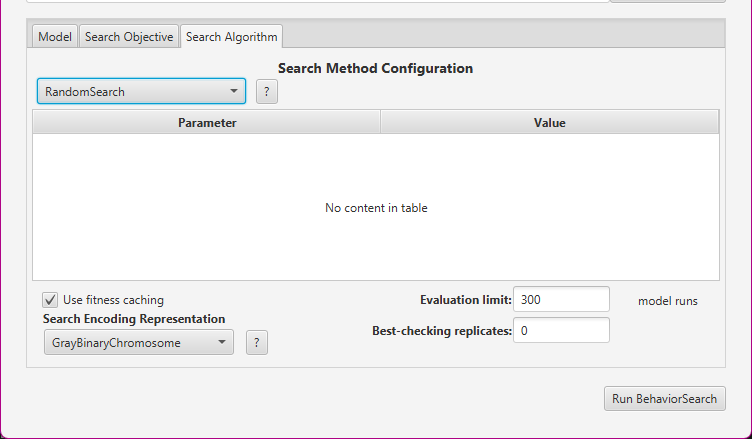
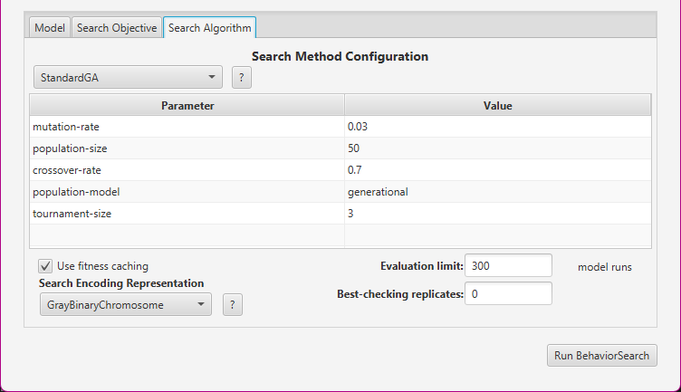
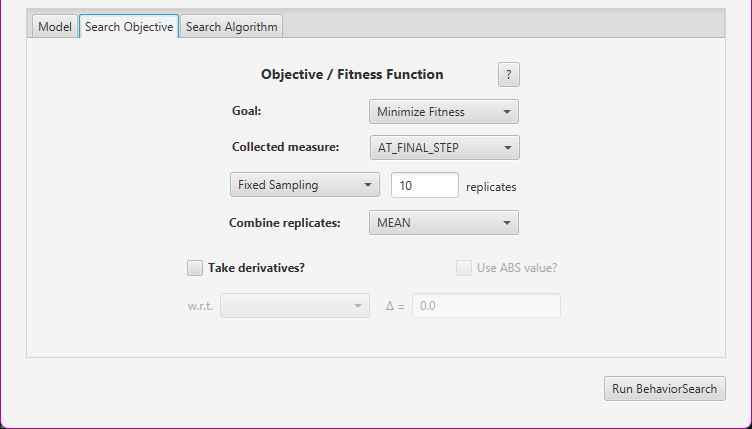
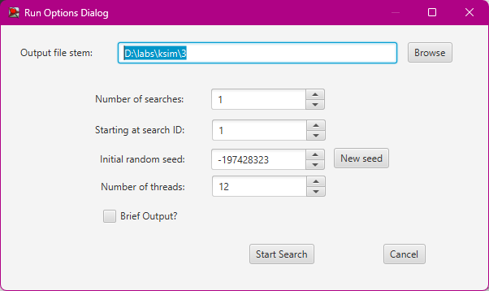
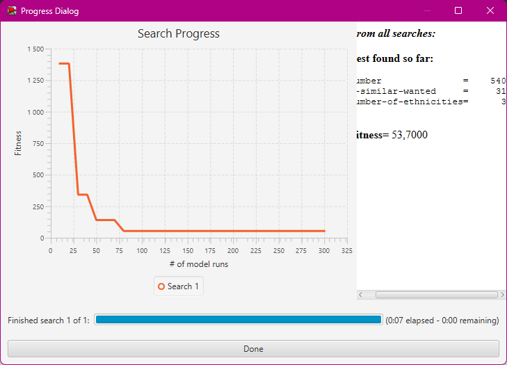
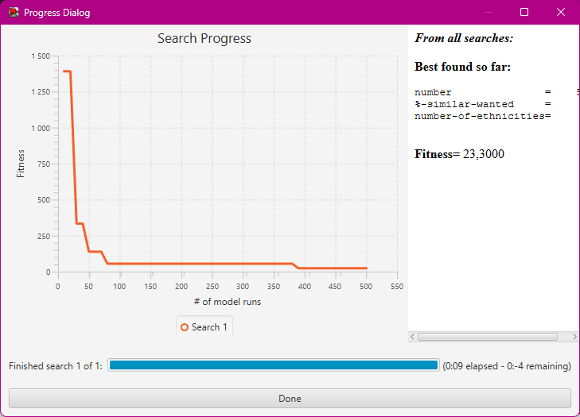

## Комп'ютерні системи імітаційного моделювання
## СПм-23-5, **Шандиба Антон Сергійович**
### Лабораторна робота №**3**. Використання засобів обчислювального интелекту для оптимізації імітаційних моделей

 

### Варіант 8, модель у середовищі NetLogo:
[Segregation Simple Extension 1](http://www.netlogoweb.org/launch#http://www.netlogoweb.org/assets/modelslib/IABM%20Textbook/chapter%203/Segregation%20Extensions/Segregation%20Simple%20Extension%201.nlogo)

 

### Вербальний опис моделі:
Цей проєкт моделює взаємодію черепах (у метафоричному сенсі) з різних етнічних груп у вигаданому водоймищі. Усі черепахи підтримують дружні відносини, проте кожна прагне жити ближче до представників своєї "рідної" групи. У рамках цієї симуляції вивчається, як індивідуальні уподобання черепах впливають на їх розташування у водоймі, що зрештою формує великомасштабні моделі.

### Керуючі параметри:
- **%-similar-wanted** контролює відсоток своїх, що хоче бачити черепах біля себе.
- **number** керує загальною кількістю черепах.
- **number-of-ethnicities** контролює кількість різних типів черепах.

### Показники роботи системи:
**percent unhappy** - показує відсоток черепах, які мають менше сусідів з однієї етнічної приналежності, ніж вони хочуть.
**percent similar** - Відображає середній відсоток сусідів однакового кольору для кожної черепахи. Спочатку цей показник становить приблизно 0,5, оскільки на початку кожна черепаха (в середньому) має рівну кількість червоних і зелених сусідів.

 

### Налаштування середовища BehaviorSearch:

**Обрана модель**:
<pre>
D:\simulation_labs\antonshandyba\Segregation Simple Extension 1.nlogo
</pre>
**Параметри моделі** (вкладка Model):  
*Параметри та їх можливі діапазони були **автоматично** вилучені середовищем BehaviorSearch із вибраної імітаційної моделі, для цього є кнопка «Завантажити діапазони параметрів із інтерфейсу моделі»*, хоча й дещо підправлені для доцільності дослідження:
<pre>
["number-of-ethnicities" [2 1 5]]
["number" [500 10 2500]]
["%-similar-wanted" [10 1 100]]
</pre>
Використовувана **міра**:  
Для фітнес-функції *(вона ж функція пристосованості або цільова функція)* було обрано **значення кількості вбивств**, вираз для її розрахунку вказано у параметрі "**Measure**":
<pre>
count-kill
</pre>
Кількість вбивств слід враховувати після завершення симуляції, починаючи з нульового такту.
Параметр "**Measure if**" із значенням true фактично означає, що враховуватимуться всі такти симуляції, а не лише їх частина. Іноді буває доцільно ігнорувати певні такти через хаотичність у деяких моделях на початкових етапах. Такий підхід, наприклад, демонструється в прикладі з документації BehaviorSearch.
Параметри "**Setup**" та "**Go**" відповідають процедурам ініціалізації та запуску моделі (зазвичай вони називаються саме так). BehaviorSearch у процесі роботи фактично виконує ці процедури від імені користувача.
Параметр зупинки за умовою ("**Stop if**") у даному випадку не застосовувався.
Загальний вигляд вкладки налаштувань параметрів моделі:  

Для випадкового пошуку:  

**Налаштування алгоритму пошуку** (вкладка Search Algorithm):  
Загальний вид вкладки налаштувань алгоритму пошуку:  
Для генетичного алгоритму:  

**Налаштування цільової функції** (вкладка Search Objective):  
Метою налаштування параметрів імітаційної моделі є мінімізація значення, що задається через параметр "**Goal**" зі значенням Minimize Fitness. У параметрі "**Collected measure**", який визначає спосіб фіксації значень вибраного показника, вказано **AT_FINAL_STEP**.
Щоб уникнути спотворення результатів через випадкові значення, які використовуються в логіці імітаційної моделі, кожна симуляція виконується 10 разів, а результуюче значення обчислюється як середнє арифметичне.
Загальний вигляд вкладки налаштувань цільової функції:  

 

### Результати використання BehaviorSearch:

Діалогове вікно запуску пошуку:  

Результат пошуку параметрів імітаційної моделі, використовуючи **випадковий пошук**:  

Результат пошуку параметрів імітаційної моделі, використовуючи **генетичний алгоритм**:  

